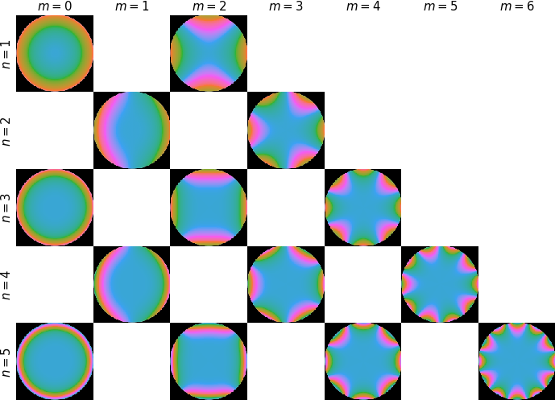
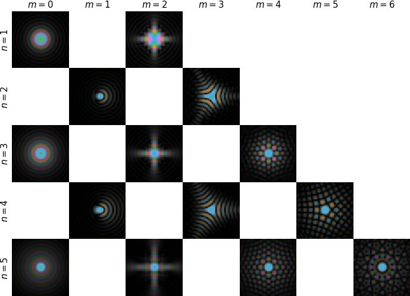

(wave-aberrations)=
## Wave aberrations

An ideal lens forms a spherical wave converging on or emerging from a single point. This means that a plane wave will be converted to a spherical wave converging at the focal point of the lens, and the image of a point source is also a point. In STEM we want the objective lens to produce the smallest possible probe and in HRTEM we want the objective lens to produce a perfect magnified image of the sample. In most cases, both of these objectives require that we minimize all aberrations as much as possible. 

However, while the last decades has seen enormous improvements in the optics of electron microscopes, they are far from ideal optical system. Imperfections causes the focused wave front to deviate from the ideal spherical surface. 

### Contrast transfer and the point-spread function

This deviation is typically expressed as a phase error or the aberration function, $\chi(\bm{k})$. Given a Fourier space wavefunction $\Psi_0(\bm{k})$ entering the lens, the wavefunction after passing through that lens can thus be expressed as 
```{math}
    \Psi(\bm{k}) = \Psi_0(\bm{k}) \mathrm{e} ^ {-i \chi(\bm{k})}.
```

Another, possibly more intuitive way of framing the phase error is the point spread function 
```{math}
    \mathrm{PSF}(\bm{r}) = \mathscr{F}^{-1}_{\bm{k} \rightarrow \bm{r}}\left\{ \mathrm{e} ^ {-i \chi(\bm{k})} \right\} ,
```
the point spread function describes how an imaging system responds to a point source. In STEM, the PSF would be the image of the probe, given an infinite objective aperture, in HRTEM the PSF would be how a perfect point source is imaged by an objective lens with an infinite collection angle.

The phase error can be expressed in different ways, however, it is traditionally written as a series expansion. One popular choice is to write it as an expansion in polar coordinates
```{math}
    \chi(k, \phi) = \frac{2 \pi}{\lambda} \sum_{n,m} \frac{1}{n + 1} C_{n,m} (k \lambda)^{n+1} \cos\left[m (\phi - \phi_{n,m}) \right] ,
```
where $k$ is the Fourier space radial coordinate and $\phi$ is the corresponding azimuthal coordinate. The coefficient $C_{n,m}$ represents the magnitude of an aberration and $\phi_{n,m}$ gives a direction to that aberration. There are other ways of representing the aberration function, you might have seen the Cartesian representation where some parameters has an "a" and "b" version.

#### Visualizing the CTF and PSF

Below we visualize each aberration by mapping the phase to different colors. We can also visualize each phase aberration by showing its effect on a small probe wave function using the PSF. Note that the magnitude of the aberrations are scaled by a power law are scaled by the radial order ($n$) according to a power law.

````{tab-set}
```{tab-item} CTF

```
```{tab-item} PSF

```
````

We can also visualize this interactively as shown in [](#fig_ctf_psf).

```{figure} #app:ctf_psf
:name: fig_ctf_psf
:placeholder: ./figures/ctf_psf.png
**Interactive widget showing the influence of common aberrations on the point spread function (PSF) and contact transfer function (CTF).**
```

### Aperture

In practice, the maximum transferred frequency is limited by the aperture of the objective lens. This is conventionally described as a multiplication with the aperture function:

$$
    \psi_{\mathrm{image}}(k, \phi) = A(k) \exp[-i \chi(k, \phi)] \psi_{\mathrm{exit}}(k, \phi),
$$

where $A(k)$ is the aperture function

$$
    A(k) = \begin{cases} 1 & \text{if } x \leq k_{cut} \\ 0 & \text{if } x > k_{cut} \end{cases} .
$$

We typically cut off the `CTF` at the angle corresponding to the Scherzer [point resolution](https://en.wikipedia.org/wiki/High-resolution_transmission_electron_microscopy#Scherzer_defocus), which is defined as the angle where the phase of the `CTF` crosses the abscissa for the first time (`crossover_angle`).

### Partial coherence (quasi-coherent)
Partial coherence acts similarly to the aperture function to dampen the high spatial frequencies of the signal. Partial coherence may be approximated by multiplying the `CTF` by envelope functions:

$$
    \psi_{\mathrm{image}}(k, \phi) = \mathrm{CTF}(k, \phi) \psi_{\mathrm{exit}}(k, \phi),
$$

where the $\mathrm{CTF}$ is now given as

$$
    \mathrm{CTF}(k, \phi) = E_t(k) E_s(k) A(k) \exp[-i \chi(k, \phi)]
$$

and $E_t(k)$ and $E_s(k)$ are the temporal and spatial envelopes, respectively (see [abTEM documentation](https://abtem.github.io/doc/user_guide/walkthrough/contrast_transfer_function.html#partial-coherence-quasi-coherent) for more detail).

### Spherical-aberration limited contrast transfer

For an uncorrected microscope the dominant aberration is the third order spherical aberration ($C_{3,0}$). Assuming the other non-symmetric components have been well aligned by the user, the contrast transfer function simplifies to:
```{math}
    \chi(k) \approx \frac{2\pi}{\lambda}\left( \frac{\lambda^2 k^2}{2} \Delta f + \frac{\lambda^4 k^4}{4} C_s \right) \quad .
```
Here we used the common aliases of the aberration coefficients, so $C10 = -\Delta f$ is the negative defocus and $C_{30} = C_s$ is the third order spherical aberration.

#### Visualizing the contrast transfer function

The contrast transfer function can also be plotted as a line profile, which *by convention* display the imaginary part of complex exponential of the phase error. The horizontal axis denotes a specific spatial frequency, while the vertical axis how the contrast at that spatial frequency is transferred.

Below in [](#fig_ctf_line), we visualize the CTF interactively for different primary beam energies, defocus values, spherical aberration, aperture cutoff, and temporal and spatial incoherences.

```{figure} #app:ctf_line
:name: fig_ctf_line
:placeholder: ./static/ctf_line.png
**Interactive widget showing the influence of common coherent and incoherent parameters on the contact transfer function (CTF).**
```